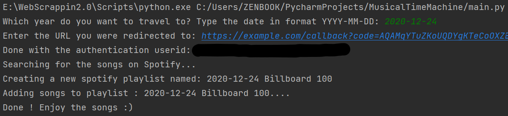
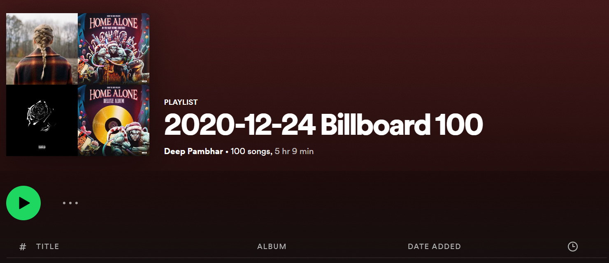

A python script which takes a date as an input and then based on that date scraps billboard.com for top 100 songs during that particular period and automatically creates a new spotify playlist comprising all those songs after user authentication.
 
Dependencies:  
~ s4(Beautiful Soup) 
~ requests 
~ spotipy 
 

 
 
